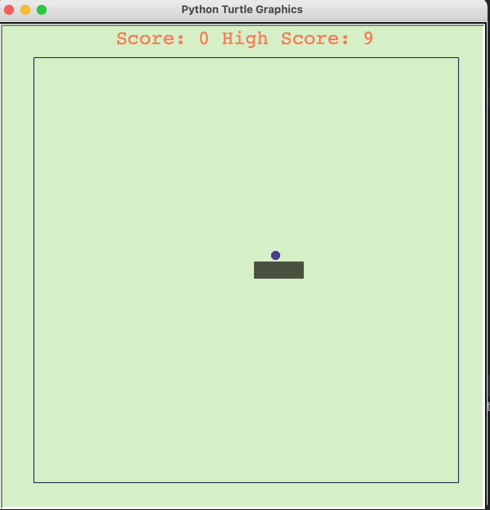
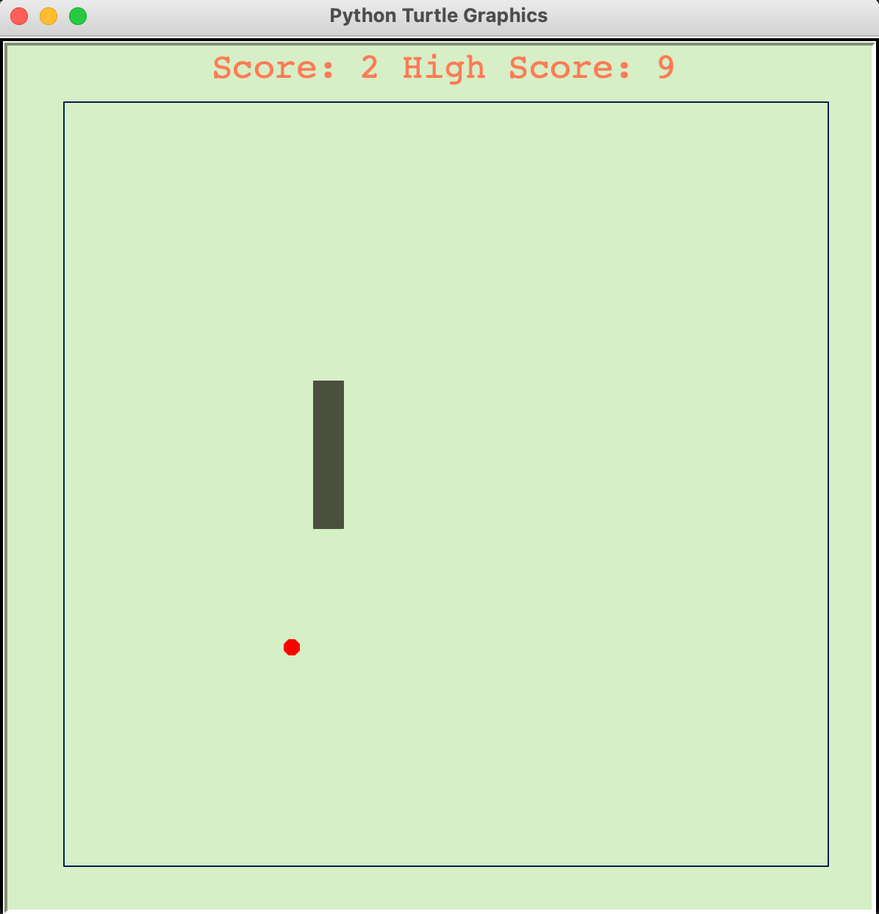

# SnakeGame_python
Snake game made using the Turtle graphics library of python
<table> 
<tr border="0">
  <td> </td>
  <td> </td>
</tr>
</table>

# Installation Requirements
1. Install python [here](https://www.python.org/downloads/)
2. Install Turtle graphics [here](https://pypi.org/project/PythonTurtle/)

# Controls
1. "UP" key : Move up
2. "DOWN" key: Move down
3. "RIGHT" key: Move right
4. "LEFT" key: Move left
